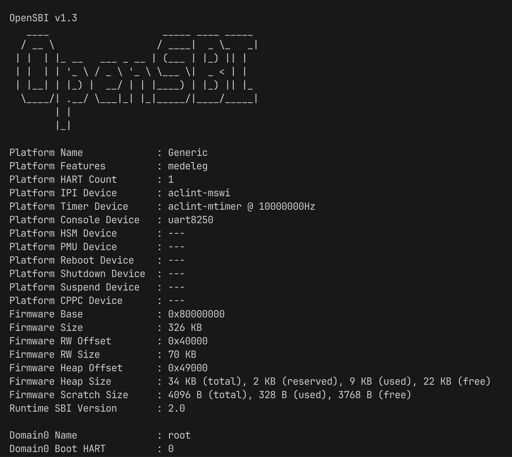

# Yuri

A riscv emulator.

Implemented: RV64IMAFDCSU

# run opensbi



```bash
git clone https://github.com/riscv-software-src/opensbi.git
cd opensbi
dtc /path/to/your/yuri/yuri.dtc > yuri.dtb
make PLATFORM=generic CROSS_COMPILE=riscv64-unknown-linux-musl- FW_FDT_PATH=./yuri.dtb
cp build/platform/generic/firmware/fw_payload.elf /path/to/your/yuri
```

```bash
cargo run --release
```


# run tests

```bash
git clone https://github.com/riscv/riscv-tests.git
cd riscv-tests
./configure && make
mkdir tests && find isa -executable -type f -exec cp {} ./tests \;
rm tests/{rv32*,rv64uzfh*,rv64mi-p-breakpoint,rv64mzicbo-p-zero,rv64ssvnapot-p-napot}
mv tests /path/to/your/yuri
```

```bash
cargo test -- --nocapture
```
